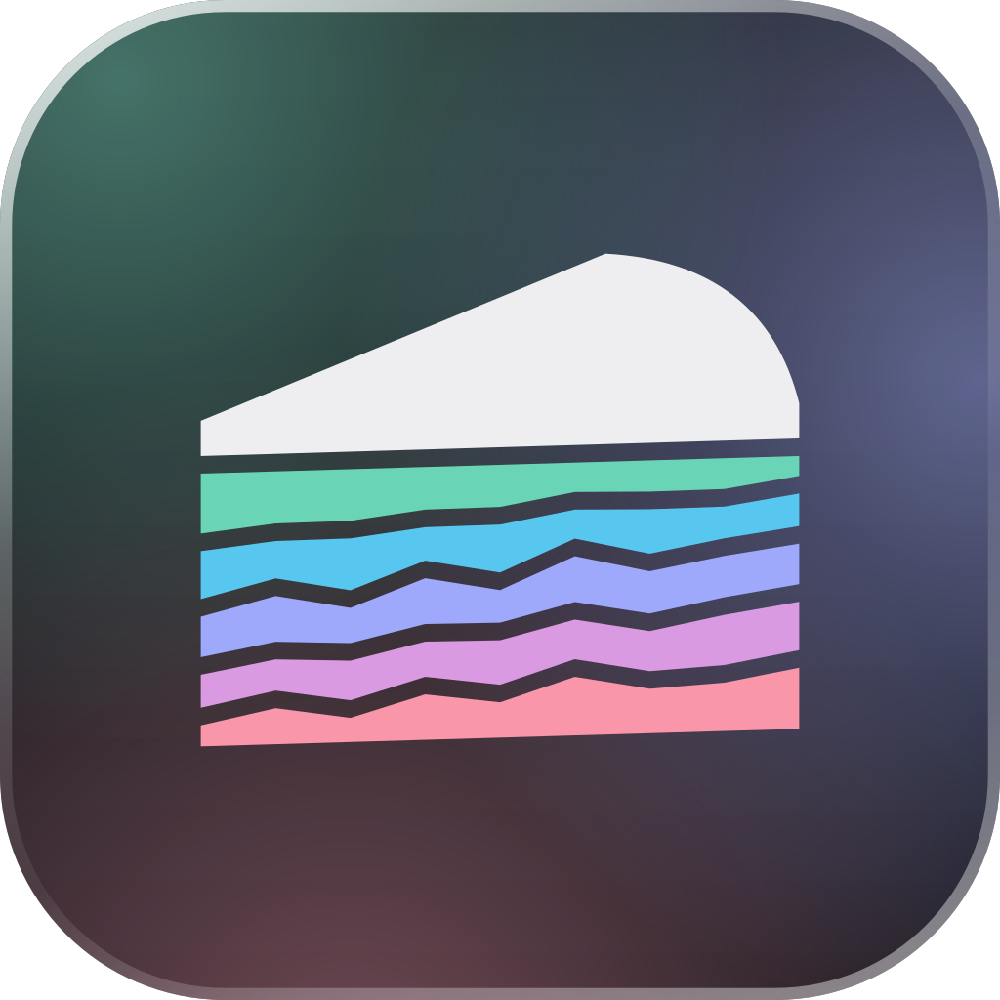
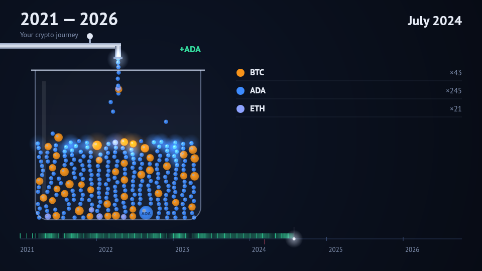

<p align="center">
  
</p>

<h1 align="center">Coineda</h1>

<p align="center">
  A crypto portfolio tracker and tax calculator that runs entirely on your own device.<br />
  No account, no server, no copy of your data anywhere but where you put it.
</p>

<p align="center">
  <a href="https://fabianbormann.github.io/Coineda/"></a>
  <a href="https://github.com/fabianbormann/Coineda/releases"></a>
  
  <a href="https://discord.gg/anryt23SB3"></a>
  <a href="LICENSE"></a>
</p>

<p align="center">
  
  <br />
  <sub>The journey video, rendered from demo data in shareable mode: no amount on the frame, so you can post it.</sub>
</p>

## Why

Every crypto tax tool asks for your exchange keys and wallet addresses, then keeps them. Coineda
asks for the same things and keeps nothing: it is a web page (or a desktop app made from the same
code) that talks to the chains and exchanges directly from your browser and stores what it learns in
your browser's own database. There is no backend to breach, no subscription, and nothing to delete
when you are done except the tab.

## What it does

- **Pulls your history from where it lives.** Add a wallet address or an exchange key and Coineda
  syncs the transactions itself, page by page, resumable, with a stop button that loses nothing.
- **Imports the rest from CSV.** Exchange exports are recognised by their content, not their file
  name, so a renamed download still lands in the right importer.
- **Finds your own transfers.** A withdrawal from an exchange and the matching deposit in your
  wallet are one movement, not a sale and a purchase. Coineda proposes the pairs and you confirm.
- **Prices everything.** Spot prices from CoinGecko, historical prices back to 2015 from DefiLlama,
  and the European Central Bank's reference rates for the fiat side, so a report can say where
  every figure came from.
- **Writes a tax report you can check.** FIFO lot matching, per-jurisdiction rules with the statutes
  they come from and the date they were last reviewed, and a printable document that names the
  disposals it could not compute instead of guessing.
- **Moves between devices without a cloud.** A checkpoint carries your settings, sources, keys and
  every event, encrypted with a one-time secret, as a QR code when it fits and a file when it does
  not. It is also your backup.
- **Tells the story.** The journey video pours every purchase into a jar as a coin along a timeline
  of your history, and exports as a clip. Shareable mode never shows an amount.

## Sources

| Chain or exchange | How                                      |
| ----------------- | ---------------------------------------- |
| Cardano           | Yaci Store (public instance by default)  |
| Cardano           | Blockfrost (your project id)             |
| Bitcoin           | Any Esplora instance, by xpub or address |
| Ethereum          | Any Blockscout instance                  |
| Bitpanda          | API key                                  |
| Binance           | CSV export                               |
| Coinbase          | CSV export                               |
| Kraken            | CSV export                               |

Modules ship in the bundle and arrive by reviewed pull request, never by download at runtime: a
source module runs beside your exchange keys, and that is not a place for code nobody has read.

## Tax jurisdictions

| Country | Rules                                                                                                             |
| ------- | ----------------------------------------------------------------------------------------------------------------- |
| Germany | §23 EStG private sales with the one-year holding period and the Freigrenze, §22 Nr. 3 EStG for staking income     |
| Austria | Flat 27.5% KESt under §27a and §27b EStG since the 2022 reform; holdings acquired before 1 March 2021 stay exempt |

Every report prints who contributed the rules, when they were last checked against the law, and the
references used. Rules unchecked for more than a year are flagged as stale on the report itself.

> **Coineda gives no tax, legal or accounting advice.** The rules are a community contribution,
> written to the best of the contributors' knowledge, and may be wrong for your situation or
> incomplete for your country. Verify a report against the cited references, or with a professional,
> before you rely on it.

## Getting started

**In the browser:** open [fabianbormann.github.io/Coineda](https://fabianbormann.github.io/Coineda/).
It is a progressive web app, so you can install it from the browser menu and use it offline. Your data
lives in that browser's storage; export a checkpoint before clearing site data.

**On the desktop:** download an installer for macOS, Windows or Linux from the
[releases page](https://github.com/fabianbormann/Coineda/releases). Same app, own window,
no browser.

**From source:**

```bash
git clone https://github.com/fabianbormann/Coineda.git
cd Coineda
npm install
npm start            # http://localhost:3000
```

```bash
npm run build        # typecheck, then a production build into build/
npx vitest run       # the test suite
npm run lint         # eslint
npm run format       # prettier
npm run electron-dev # the desktop shell against the dev server
npm run dist         # desktop installers
```

Interface languages: English and German.

## Contributing

The two places that grow are the two places built to be extended by people who have never seen the
rest of the codebase:

- **A new source** is a pure translator from a provider's records to ledger events, with a
  conformance test suite that tells you what you got wrong. Start with
  [Writing a source module](docs/modules/writing-a-source-module.md).
- **A new tax jurisdiction** is a classifier plus the thresholds and references for one country,
  gated by golden fixtures. Start with [Writing a tax module](docs/modules/writing-a-tax-module.md).

Translations live in [`src/translations`](src/translations/), keyed by the English string.

Commits follow [Conventional Commits](https://www.conventionalcommits.org/); the changelog and the
version number are generated from them. See [CONTRIBUTING.md](CONTRIBUTING.md) for how pull requests
are reviewed, and the [code of conduct](CODE_OF_CONDUCT.md) for how we treat each other.

## License

[GPL-3.0](LICENSE). Your data is yours, and so is the code.
